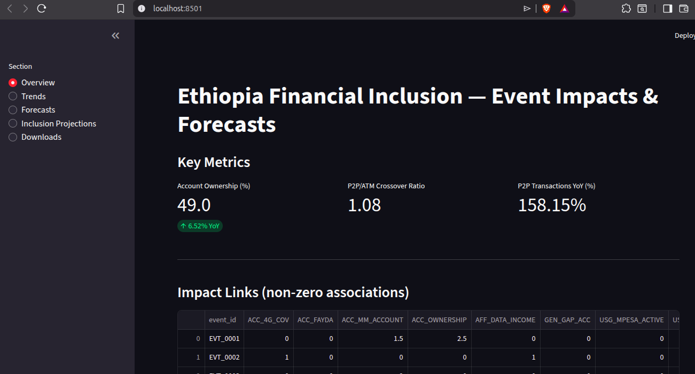
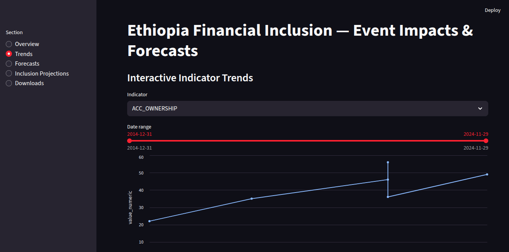
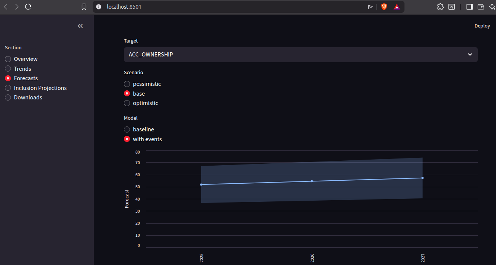
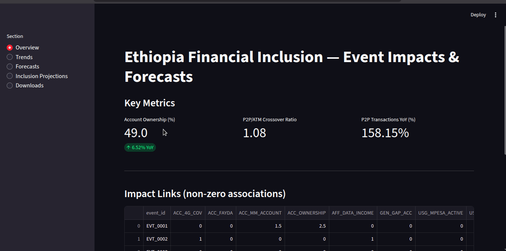

# Ethiopia Financial Inclusion — Event Impacts, Forecasts, and Dashboard

A reproducible workflow to enrich data, analyze event impacts, generate forecasts (2025–2027), and deliver an interactive Streamlit dashboard.

## Quick Start

```bash
# 1) Create/activate Python env (example)
python -m venv .venv && source .venv/bin/activate
pip install -r requirements.txt

# 2) Generate artifacts (if not already created)
python src/build_event_indicator_matrix.py   # writes trimmed association CSV; heatmap if libs available

# 3) Run notebooks (Task 4 forecasting)
# Open notebooks/04_forecasting_access_usage.ipynb and Run All

# 4) Launch dashboard (Task 5)
streamlit run dashboard/app.py
```

## Repository Structure

- data/processed/ — unified dataset and derived CSVs
- notebooks/ — analysis and modeling notebooks
- reports/ — markdown reports and exports (CSV/PNG)
- src/ — helper scripts (matrix builder, etc.)
- dashboard/ — Streamlit application
- tests/ — pytest checks for core artifacts
- .github/workflows/ — CI configuration

## Data Schema (Unified CSV)

The combined dataset organizes rows by `record_type`:
- observation: time series points (`indicator_code`, `observation_date`, `value_numeric`)
- event: dated developments; referenced by impact links
- impact_link: explicit links from events to indicators with fields: `pillar`, `related_indicator`, `impact_direction`, `impact_magnitude`, `lag_months`, `evidence_basis`, `source_url`
- target: (optional) target levels for reference

## Task 1 — Data Enrichment

- Input: unified CSV at data/processed/ethiopia_fi_unified_data_combined.csv
- Output: updated enrichment log and validated fields
- Artifacts:
  - reports/data_enrichment_log.md — added entries with `source_url`, `original_text`, `confidence`, `collected_by`, `collection_date`, `notes`

## Task 2 — EDA and Reporting

- Notebook: notebooks/02_eda_analysis.ipynb
- Report: reports/eda_report.md
- Figures (examples): reports/figures/account_ownership_timeline.png, growth_rate_comparison.png, p2p_vs_atm.png
- Notes: paths in notebooks use `../data/processed/...` to reference the combined CSV.

## Task 3 — Event Impact Modeling

- Notebook: notebooks/03_event_impact_modeling.ipynb
- Method:
  - Build event–indicator association matrix (sum of `effect = magnitude × direction` per link)
  - Time-distributed effects via a ramp over `lag_months`
  - Diagnostics, trimmed matrix, and top impacts summary
- Script: src/build_event_indicator_matrix.py
  - Writes: data/processed/event_indicator_association_trimmed.csv
  - Tries to save heatmap PNG (skips gracefully if plotting libs missing)
- Artifacts:
  - reports/event_impact_methodology.md
  - reports/event_impact_validation.md
  - reports/impact_links_missing_fields.csv (audit)

## Task 4 — Forecasting Access & Usage (2025–2027)

- Notebook: notebooks/04_forecasting_access_usage.ipynb
- Targets:
  - ACC_OWNERSHIP (%)
  - Digital usage: percent series if available; else `USG_P2P_COUNT` as volume proxy
- Models:
  - Anchored linear trend (anchor at 2024), RMSE-based CI (inflated to 15% band when few points)
  - Event-augmented deltas from Task 3 timelines
  - Scenarios: pessimistic/base/optimistic via slope and event multipliers
- Artifacts:
  - reports/forecast_access_usage_2025_2027.csv
  - reports/figures/forecast_access_usage.png (note: reports/figures is git-ignored by default)
  - reports/forecast_interpretation.md

## Task 5 — Dashboard (Streamlit)

- App: dashboard/app.py
- Sections:
  - Overview: key metrics, P2P/ATM crossover ratio, association matrix preview + download
  - Trends: interactive time series with date range selector; P2P vs ATM comparison
  - Forecasts: scenario plots with confidence intervals; baseline vs with-events; table + downloads
  - Inclusion Projections: progress toward 60% target with scenario/model selector and milestone detection
  - Downloads: filtered combined data, filtered forecasts, impact heatmap + CSV download
- Run:
  - `streamlit run dashboard/app.py`

## CI/CD

- Workflow: .github/workflows/unittests.yml — runs on push/PR to main
- Dependencies: requirements-ci.txt (pytest-only) for fast CI
- Tests:
  - tests/test_forecasting_outputs.py — validates presence and schema of Task 4 artifacts, with PNG check skipped if git-ignored

## Repro Steps (End-to-End)

1. Ensure combined CSV is present: data/processed/ethiopia_fi_unified_data_combined.csv
2. Build association matrix:
   - `python src/build_event_indicator_matrix.py`
3. Run Task 4 notebook to generate forecasts and interpretation:
   - Open and execute notebooks/04_forecasting_access_usage.ipynb
4. Launch the dashboard:
   - `streamlit run dashboard/app.py`

## Branching & PRs

- task-1, task-2, task-3, task-4, task-5 branches merged into `main` via PRs
- Suggested commit messages:
  - Task 4: "Forecasts (2025–2027) with anchored scenarios, CI, interpretation"
  - Task 5: "Streamlit dashboard: overview, trends, forecasts, inclusion projections, downloads"

## Troubleshooting

- Heatmap PNG missing: install plotting libs and re-run builder script or notebooks
  - `pip install matplotlib seaborn`
  - `python src/build_event_indicator_matrix.py`
- CI run queued: try workflow dispatch, re-run jobs, or push a no-op commit
- Dashboard errors: confirm data paths exist; run notebooks to generate required CSVs


## Screenshots

### Dashboard Landing


### Trends Page


### Forecasts Page


### Demo (GIF)

